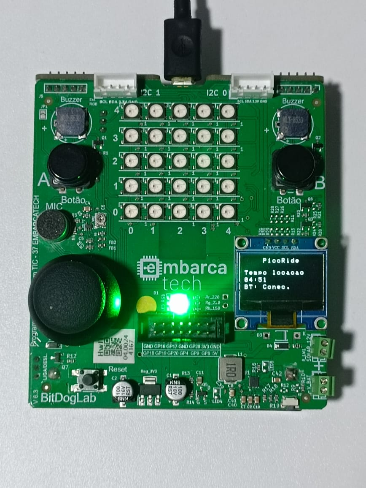
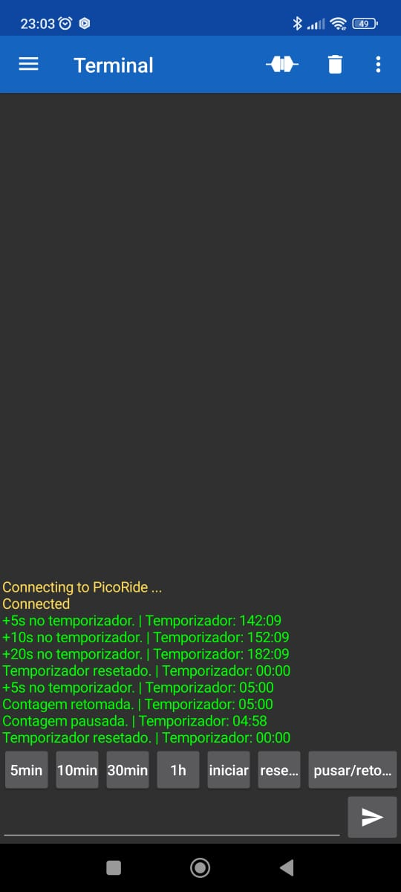

# PicoRide

<div align="center">
  
</div>

## Visão Geral

PicoRide é um projeto portátil de gestão de locação de veículos infantis, como motos elétricas, controlado via Bluetooth. Ele permite gerenciar o temporizador dos veículos, oferecendo uma solução prática e eficiente para locações temporárias. O projeto demonstra a integração de sistemas operacionais em tempo real com hardware embarcado para criar uma aplicação funcional.

## Funcionalidades

- **Comunicação Bluetooth**: Permite comunicação sem fio com dispositivos externos.
- **Display OLED**: Exibe informações em tempo real, como contagem regressiva do temporizador e status da conexão Bluetooth.
- **Controle de LEDs**: Indicadores visuais para estados do acionamento da energia do veiculo.
- **Controle de Buzzer**: Fornece feedback sonoro para ações do usuário.
- **Integração com FreeRTOS**: Gerencia múltiplas tarefas de forma eficiente.

## Como Configurar o Ambiente

1. Instale o [Visual Studio Code (VS Code)](https://code.visualstudio.com/).
2. Instale o [Git](https://git-scm.com/).
3. No VS Code, instale a extensão "Raspberry Pi Pico".
4. Certifique-se de que a SDK do Raspberry Pi Pico W está configurada na versão 2.1.1.
5. Importe o projeto utilizando a extensão "Raspberry Pi Pico" no VS Code. Basta abrir a pasta do projeto e seguir as instruções da extensão para configurar o ambiente.
6. Abra um terminal Bash no diretório do projeto no VS Code e rode os comandos abaixo:

7. Dê permissão de execução ao instalador Bash:

   ```bash
   chmod +x instalador_freertos.sh
   ```

8. Execute o instalador para clonar o FreeRTOS:

   ```bash
   ./instalador_freertos.sh
   ```

## Como Compilar e Executar

1. Certifique-se de que o SDK do Raspberry Pi Pico está instalado.
2. Use o botão "Compile" da extensão "Raspberry Pi Pico" no VS Code para compilar o projeto.
3. Conecte o Raspberry Pi Pico W ao computador via USB enquanto mantém o botão BOOTSEL pressionado para entrar no modo de carregamento do bootloader.
4. Após compilar, clique no botão "Run" da extensão para carregar o binário no dispositivo.

## Como Usar o Dispositivo Bluetooth

1. **Baixe o Aplicativo**  
   Acesse a loja de aplicativos do seu smartphone e baixe o app [Serial Bluetooth Terminal](https://play.google.com/store/apps/details?id=de.kai_morich.serial_bluetooth_terminal&hl=pt_BR).

<div align="center">
  
</div>

2. **Configuração dos Botões**  
   Configure os botões no aplicativo para enviar os seguintes comandos correspondentes às funcionalidades do dispositivo. O nome do botão deve refletir a ação realizada:

   - **Botão `+5 min`**: Envia o comando **`a`** para adicionar +5 minutos ao temporizador.
   - **Botão `+10 min`**: Envia o comando **`b`** para adicionar +10 minutos ao temporizador.
   - **Botão `+30 min`**: Envia o comando **`c`** para adicionar +30 minutos ao temporizador.
   - **Botão `+60 min`**: Envia o comando **`d`** para adicionar +60 minutos ao temporizador.
   - **Botão `Iniciar`**: Envia o comando **`i`** para iniciar a contagem (se o temporizador estiver configurado).
   - **Botão `Pausar/Retomar`**: Envia o comando **`p`** para pausar ou retomar a contagem.
   - **Botão `Resetar`**: Envia o comando **`r`** para resetar o temporizador.

3. **Pareamento com o Smartphone**  
   - Ative o Bluetooth no seu smartphone e selecione o dispositivo para parear.
   - No aplicativo, clique no menu superior esquerdo (ícone com 3 traços horizontais) e selecione "Devices".
   - Escolha o dispositivo correspondente ao PicoRide para realizar o pareamento.

4. **Conexão com o Dispositivo**  
   - Retorne à tela principal do aplicativo.
   - Clique no ícone de conexão (primeiro ícone no lado direito).
   - Após conectar, você poderá enviar os comandos configurados para controlar o dispositivo.

Agora o dispositivo está pronto para uso via Bluetooth!

### Depuração Serial

Para utilizar a comunicação serial:

- Conecte um adaptador USB-Serial ao dispositivo (opcional durante o desenvolvimento).
- Conecte o GND do adaptador ao GND do Pico, o RX do adaptador ao TX do Pico (GPIO 0), e o TX do adaptador ao RX do Pico (GPIO 1).
- Configure a velocidade da comunicação serial para 115200 bps.

## Desenvolvedores

- Georgines Bezerra: [georgines](https://github.com/georgines)
- Tacila Nunes: [tacinunesc](https://github.com/tacinunesc)
- Diego Souza: [diego-soz](https://github.com/diego-soz)

## Bluetooth

A biblioteca de Bluetooth utilizada neste projeto foi criada com base na seguinte biblioteca:

[MrGreensWorkshop RasPiPicoSDK_BT_Classic_SPP](https://github.com/MrGreensWorkshop/RasPiPicoSDK_BT_Classic_SPP/tree/main)

## Licença

Este projeto é open-source e está disponível sob a licença MIT.
